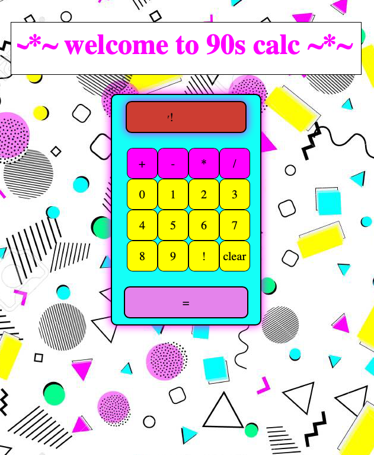

# Welcome to 90s Calc!
If you can't have fun with javascript, when CAN you? 

This 90s styled calculator lets you do math but also experience some of that radical 90s nostalgia. 

Also plays a fun midi, if you're not in Safari!

# To Run
- Clone & doubleclick that file to load into a browser. 

# Features
- Like, totally has a midi player
- Fun 90s styling with a javascript-y surprise!
- Marquees for days

# To-Do
- Find a better midi file
- Make a repeating background
- Make the hooray button more fun: my never ending quest
- Explore adding CSS styling with classList.add in Javascript 

# To-Done
- More fun hooray button: drop shadows on everything
- Better styling on the buttons
- More fun hooray button: pleasing 90s color palette
- More fun hooray button: more things change colors
- More fun hooray button: random color-changing buttons!
- More fun hooray button: ...and it's on a timer!